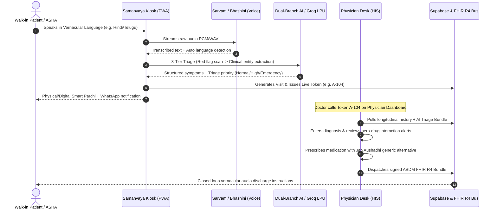

# 🏥 Project Samanvaya (समन्वय)
### National Smart Case-Taking & AYUSH-Allopathic Clinical Intelligence Platform
> *Empowering 1.4 Billion Citizens with Universal, Vernacular, Zero-Barrier Healthcare under the National Health Mission (NHM) and Ayushman Bharat Digital Mission (ABDM).*

---

## 📑 Table of Contents
1. [🌟 Executive Overview & Mental Model](#-executive-overview--mental-model)
2. [🏗️ System Architecture & Data Flow](#️-system-architecture--data-flow)
3. [🚀 Complete Feature Catalog](#-complete-feature-catalog)
   - [A. Citizen & Patient Experience (Public Portal)](#a-citizen--patient-experience-public-portal)
   - [B. Hospital Information System (HIS) Clinical Enclave](#b-hospital-information-system-his-clinical-enclave)
   - [C. Extraordinary Healthcare Innovations](#c-extraordinary-healthcare-innovations)
4. [🧠 AI, Voice & Interoperability Architecture](#-ai-voice--interoperability-architecture)
   - [3-Tier Fault-Tolerant Routing Net](#3-tier-fault-tolerant-routing-net)
   - [Dual-Branch Clinical Synthesis](#dual-branch-clinical-synthesis)
   - [22-Language Indic Voice Stack (Sarvam + Bhashini)](#22-language-indic-voice-stack-sarvam--bhashini)
   - [Clinical RAG Knowledge Engine](#clinical-rag-knowledge-engine)
5. [📁 Codebase Directory Structure](#-codebase-directory-structure)
6. [🔌 Complete API Reference](#-complete-api-reference)
   - [Backend FastAPI Endpoints](#backend-fastapi-endpoints-8000)
   - [Frontend Next.js Route Handlers](#frontend-nextjs-route-handlers-3000)
7. [🗄️ Database & Vector Storage Schema](#️-database--vector-storage-schema)
8. [🛠️ Developer Quickstart & Local Setup](#️-developer-quickstart--local-setup)
9. [🔐 Clinical Credentials & Role Gate Guide](#-clinical-credentials--role-gate-guide)
10. [🧪 Testing & Verification](#-testing--verification)
11. [🛡️ Statutory Compliance (DPDP Act 2023 & ABDM)](#️-statutory-compliance-dpdp-act-2023--abdm)
12. [❓ Troubleshooting & Developer FAQs](#-troubleshooting--developer-faqs)

---

## 🌟 Executive Overview & Mental Model

**Project Samanvaya** (*Sanskrit: समन्वय • Harmonious Integration*) solves the single biggest bottleneck in public healthcare facilities across India:

> **The Core Problem:** Not simply "digitizing intake forms" — but **ensuring a patient's case never falls through linguistic, diagnostic, or administrative cracks between walking into a hospital and receiving clinical treatment.**

### The Core Mental Model for New Developers
When working on Samanvaya, keep two core design principles in mind:

1. **Patient-First Priority (Zero Login Friction):**
   - 95% of users visiting the platform are walk-in patients, rural citizens, ASHA workers, or family caregivers.
   - They must **never** be met with a login barrier, complex password, or medical jargon.
   - All citizen tools (ABHA card generation, PM-JAY scheme eligibility, Jan Aushadhi generic drug lookup, Tele-MANAS crisis care, AYUSH Prakriti profiling, and live OPD queue passes) are completely open, free, and instantly accessible.

2. **Protected HIS Clinical Enclave (Statutory Role Segregation):**
   - Clinical diagnostic tools, doctor consultation desks, CDSS (Clinical Decision Support Systems), ICMR protocol RAG, vitals registration, prescription writing, and WHO AWaRe antimicrobial stewardship are restricted to verified medical practitioners.
   - The enclave gate is implemented in `frontend/app/his/layout.tsx` using a clean, light-themed national portal design.
   - Unauthenticated citizens attempting to open clinical URLs are gracefully redirected to the Authorization Gate, keeping clinical data secure under the **DPDP Act 2023**.

---

## 🏗️ System Architecture & Data Flow

### High-Level System Architecture

```mermaid
flowchart TD
    subgraph Public_Citizen_Portal [1. Public Citizen Portal (Zero Login Friction)]
        A[Citizen / Patient Visit] --> B[Home Landing Portal]
        B --> C1[Download 3D ABHA Smart Card]
        B --> C2[PM-JAY & 36 States Scheme Navigator]
        B --> C3[Prescription OCR & Jan Aushadhi Savings]
        B --> C4[Tele-MANAS 14416 Mental Wellness]
        B --> C5[AYUSH Prakriti Constitutional Profiler]
        B --> C6[Live OPD Token Pass - Citizen View]
    end

    subgraph Security_Gate [2. Statutory Security & Role Guard]
        D{Role & Route Guard}
        B -. "Clicks 'Hospital & Staff (HIS)'" .-> D
        D -- "Unauthenticated Patient Hits /his/*" --> G[Light White Enclave Gate]
        G -- "Sign In with NUID / Staff ID" --> D
        D -- "Verified Medical Practitioner" --> E[HIS Clinical Suite]
    end

    subgraph HIS_Clinical_Enclave [3. HIS Clinical Enclave (Restricted)]
        E --> H1[Physician OPD Consultation Desk & CDSS]
        E --> H2[Smart Parchi Registration & Vitals Triage]
        E --> H3[Clinical RAG Co-Pilot - ICMR / AIIMS Guidelines]
        E --> H4[WHO AWaRe Antimicrobial Stewardship Audit]
        E --> H5[DPDP 2023 Statutory Consent & Audit Console]
        E --> H6[Hospital Live TV Queue Display & Audio Chime]
    end

    subgraph Dual_Branch_AI_Stack [4. Dual-Branch AI & Interoperability Stack]
        H1 & H2 & C3 --> I1[Tier 1: Groq Llama Sub-Second Routing]
        H1 & H2 --> I2[Tier 2: Deterministic Red-Flag Emergency Net]
        H1 & H3 --> I3[Tier 3: NVIDIA NIM 70B & Phi-4 Vision Clinical Structuring]
        B & C1 & H2 --> J1[Sarvam AI + Bhashini Multilingual Voice STT/TTS]
        H1 & H2 --> K1[ABDM FHIR R4 JSON Standard Data Bus]
        K1 --> L1[Supabase PostgreSQL Encrypted Health Vault]
    end
```

### End-to-End Clinical Data Flow


```mermaid
sequenceDiagram
    autonumber
    actor Patient as Walk-in Patient / ASHA
    participant Kiosk as Samanvaya Kiosk (PWA)
    participant Speech as Sarvam / Bhashini (Voice)
    participant AI as Dual-Branch AI / Groq LPU
    participant Doctor as Physician Desk (HIS)
    participant DB as Supabase & FHIR R4 Bus

    Patient->>Kiosk: Speaks in Vernacular Language (e.g. Hindi/Telugu)
    Kiosk->>Speech: Streams raw audio PCM/WAV
    Speech-->>Kiosk: Transcribed text + Auto language detection
    Kiosk->>AI: 3-Tier Triage (Red flag scan -> Clinical entity extraction)
    AI-->>Kiosk: Structured symptoms + Triage priority (Normal/High/Emergency)
    Kiosk->>DB: Generates Visit & Issues Live Token (e.g. A-104)
    Kiosk-->>Patient: Physical/Digital Smart Parchi + WhatsApp notification
    Note over Doctor: Doctor calls Token A-104 on Physician Dashboard
    Doctor->>DB: Pulls longitudinal history + AI Triage Bundle
    Doctor->>Doctor: Enters diagnosis & reviews herb-drug interaction alerts
    Doctor->>Doctor: Prescribes medication with Jan Aushadhi generic alternative
    Doctor->>DB: Dispatches signed ABDM FHIR R4 Bundle
    DB-->>Patient: Closed-loop vernacular audio discharge instructions
```

---

## 🚀 Complete Feature Catalog

### A. Citizen & Patient Experience (Public Portal)

| Feature | Route | Key Technologies | Description |
|---|---|---|---|
| **Home Landing Portal** | `/` | Next.js, Framer Motion, Lucide | High-aesthetic patient portal displaying all citizen health modules, emergency helplines, live stats, and quick links. Fully responsive with glassmorphic cards. |
| **My ABHA 3D Smart Card** | `/patient` | CSS 3D Transforms, Web Crypto, LocalStorage | Instant 14-digit Ayushman Bharat Health Account creator. Generates an interactive 3D flip card with QR code, blood group, emergency contact, and organ donor status. Cached offline. |
| **PM-JAY & 36 States Scheme Navigator** | `/his/schemes` | Dynamic Rules Engine, `schemes_repository.py` | Evaluates eligibility across central funds (PM-JAY ₹5L cover, Senior Citizen 70+ Vay Vandana) and state funds (Aarogyasri, MJPJAY, Karunya, Swasthya Sathi). Adapts by state ration card color and income. |
| **Prescription OCR & Jan Aushadhi Finder** | `/his/ocr` | NVIDIA Phi-4 Multimodal, Vision AI, Leaflet Map | Scans handwritten or printed prescriptions, extracts active generic salts, and identifies equivalent Jan Aushadhi (PMBJP) generic drugs offering **up to 85% cost reduction**. Maps nearest kendras with GPS. |
| **Tele-MANAS Mental Wellness** | `/his/tele-manas` | Web Audio API, SVG Pacers | De-stigmatized 24x7 psychological support integrated with national helpline **14416**. Features somatic distress assessment, guided Pranayama breathing pacers, and calming audio. |
| **AYUSH Prakriti Constitutional Profiler** | `/his/ayush` | Ayurvedic Tridosha Matrix | Interactive clinical questionnaire analyzing *Vata, Pitta, and Kapha* balance. Outputs personalized *Ahara* (dietary), *Vihara* (lifestyle), and seasonal *Ritucharya* routines. |
| **Live OPD Queue Pass (Citizen View)** | `/his/queue` | Server-Sent Events / WebSockets | Displays live queue position, estimated wait times, assigned consultation room, and attending physician. Administrative token controls are hidden for citizens. |

---

### B. Hospital Information System (HIS) Clinical Enclave

| Feature | Route | Authorization | Description |
|---|---|---|---|
| **HIS Operations Hub** | `/his` | Doctor / Staff | Central launcher for all clinical tools, hospital bed occupancy stats, triage loads, and statutory compliance indicators. |
| **Physician Consultation Desk** | `/his/doctor` | Doctor Only | Longitudinal patient timeline with vitals radar, past encounters, and AI-assisted e-Prescription authoring with real-time **herb-drug conflict warnings** (e.g., Ashwagandha + Sedatives). Outputs ABDM FHIR R4 bundles. |
| **Smart Parchi Registration Kiosk** | `/his/registration` | Staff / Kiosk | 12-step guided intake: Language $\rightarrow$ Mode $\rightarrow$ ABHA ID $\rightarrow$ DPDP Consent $\rightarrow$ Voice Triage $\rightarrow$ Document Scan $\rightarrow$ AYUSH $\rightarrow$ Scheme Check $\rightarrow$ Red Flag $\rightarrow$ Token $\rightarrow$ Case Summary $\rightarrow$ Doctor Hand-off. |
| **Clinical RAG Co-Pilot** | `/his/rag` | Doctor / Staff | Evidence-grounded medical search powered by ICMR Standard Treatment Workflows, AIIMS protocols, and StatPearls. Features interactive diagnostic check panels. |
| **WHO AWaRe Antimicrobial Stewardship** | `/his/antimicrobial` | Doctor Only | Audits hospital antibiotic prescriptions against WHO classifications (**Access, Watch, Reserve**). Flags fluoroquinolone and macrolide overuse to prevent antimicrobial resistance (AMR). |
| **DPDP Act 2023 Consent Manager** | `/his/dpdp` | Staff / Admin | Statutory compliance console displaying cryptographic SHA-256 consent hashes, purpose-bound access logs, and one-click patient data revocation. |

---

### C. Extraordinary Healthcare Innovations

1. **Babel Fish Dialect-to-Medical Translator (`translate_dialect_to_medical`):**
   - Translates vernacular colloquial idioms into clinical medical terminology (e.g., *"chhati pe patthar rakha hai lag raha"* $\rightarrow$ *"Patient reports crushing retrosternal chest discomfort"*).
2. **Cross-System Herb-Drug Conflict Checker (`check_herb_drug_conflict`):**
   - Evaluates allopathic medications against ayurvedic/homeopathic remedies (e.g., Metformin + Karela leading to profound hypoglycemia, or Aspirin + Ginkgo Biloba increasing hemorrhage risk).
3. **Deterministic Emergency Red-Flag Net (`flag_low_confidence_triage`):**
   - Guarantees zero hallucinations for life-threatening keywords (crushing chest pain, facial droop, severe hemoptysis, anaphylaxis) with instantaneous `< 5ms` triage escalation.
4. **Voice-to-FHIR Reverse Doctor Dictation (`append_doctor_dictation_to_fhir`):**
   - Converts natural doctor speech during consultation directly into structured ABDM-compliant FHIR R4 Observations and MedicationRequests.
5. **Climate & Outbreak Epidemiology Radar (`get_climate_epidemiology_analytics`):**
   - Correlates postal-code weather data, humidity, and local festivals with historical outbreak spikes (dengue, cholera, respiratory infections) for preventive resource allocation.
6. **Self-Scoped Stalled Case Flag (`flag_stalled_cases`):**
   - Monitors the OPD queue in real time. Automatically flags high-priority or vulnerable patients waiting longer than 2 hours without physician review.
7. **DPDP Zero-Knowledge Media Purge (`delete_raw_data`):**
   - Section 6 compliant data minimization: raw audio recordings and camera prescription captures are extracted in-memory into structured text, after which raw binary artifacts are immediately deleted.

---

## 🧠 AI, Voice & Interoperability Architecture

### 3-Tier Fault-Tolerant Routing Net

To deliver both sub-second responsiveness at kiosks and deep clinical accuracy for doctors, Samanvaya uses a 3-tier model routing pipeline:

```
[ Incoming User Input (Voice / Text) ]
                 │
                 ▼
 ┌────────────────────────────────────────────────────────┐
 │ Tier 1: Sub-Second Intent Routing (Groq LPU Engine)    │
 │ - Latency: < 250ms                                     │
 │ - Parses conversational intent, quick chips, UI route  │
 └───────────────────────┬────────────────────────────────┘
                         │
                         ▼
 ┌────────────────────────────────────────────────────────┐
 │ Tier 2: Deterministic Safety Net (Zero-Hallucination)  │
 │ - Latency: < 5ms                                       │
 │ - High-speed regex & clinical dictionary scan          │
 │ - Immediately flags Red-Flag Emergencies (Chest pain)  │
 └───────────────────────┬────────────────────────────────┘
                         │
                         ▼
 ┌────────────────────────────────────────────────────────┐
 │ Tier 3: Deep Clinical Structuring (NVIDIA NIM 70B)     │
 │ - Latency: ~ 1.2s                                      │
 │ - SNOMED-CT extraction, ICD-10 coding, FHIR R4 bundling│
 │ - Grounded against ICMR guidelines & StatPearls        │
 └────────────────────────────────────────────────────────┘
```

### Dual-Branch Clinical Synthesis
Managed in `backend/app/services/dual_model_service.py`:
- **Branch 1 (High-Param General Foundation):** Handles complex multilingual conversations, multi-party family dialogues, and contextual civic queries using large parameter foundation models.
- **Branch 2 (Medical Specialist Branch):** Utilizes specialized medical models (such as Palmyra-Med-70B / Llama 3.3 70B Medical Instruct) specifically trained on clinical corpora and USMLE/ICMR protocols for pharmacovigilance and treatment reasoning.

### 22-Language Indic Voice Stack (Sarvam + Bhashini)
1. **Sarvam AI Engine (`sarvam_service.py`):**
   - **ASR (Saaras v3):** Fast transcription of Indian-accent English and regional vernaculars.
   - **TTS (Bulbul v3):** Expressive, natural-sounding voice synthesis with male/female pitch modulation.
   - **Multi-Key Pool:** Automatically rotates across configured API keys (`SARVAM_API_KEY_1` through `8`) to prevent rate-limiting in high-traffic hospital environments.
2. **Digital India Bhashini Engine (`bhashini_service.py`):**
   - Government of India ULCA pipeline providing ASR, NMT (Neural Machine Translation), and TTS across all 22 scheduled Indian languages.
   - Integrated with Automatic Language Detection (ALD) to instantly identify spoken dialects.

---

## 📁 Codebase Directory Structure

```
Project-Samanvaya/
├── frontend/                               # Next.js 16 (React 19 + Turbopack) Frontend
│   ├── app/
│   │   ├── layout.tsx                      # Root layout, Geist typography & LanguageProvider
│   │   ├── page.tsx                        # Public Citizen Homepage (Patient-First View)
│   │   ├── globals.css                     # Tailwind v4 tokens, glassmorphism & gradients
│   │   ├── patient/
│   │   │   └── page.tsx                    # My ABHA 3D Smart Card & Health Locker
│   │   ├── his/                            # Hospital Information System (HIS) Enclave
│   │   │   ├── layout.tsx                  # Light/White Theme Route Guard & Auth Barrier
│   │   │   ├── page.tsx                    # HIS Operations Hub & Terminal Launcher
│   │   │   ├── doctor/page.tsx             # Physician Consultation Desk & CDSS
│   │   │   ├── registration/page.tsx       # 12-Step Smart Parchi Registration Kiosk
│   │   │   ├── schemes/page.tsx            # PM-JAY & 36 States Scheme Eligibility Engine
│   │   │   ├── ocr/page.tsx                # Prescription OCR & Jan Aushadhi Savings
│   │   │   ├── queue/page.tsx              # Live OPD Queue & SMS Alert Gateway
│   │   │   ├── tele-manas/page.tsx         # Tele-MANAS 14416 Mental Health Portal
│   │   │   ├── ayush/page.tsx              # AYUSH Prakriti Pariksha Profiler
│   │   │   ├── rag/page.tsx                # Clinical RAG Co-Pilot & ICMR Workflows
│   │   │   ├── antimicrobial/page.tsx      # WHO AWaRe Antimicrobial Audit Dashboard
│   │   │   └── dpdp/page.tsx               # DPDP 2023 Consent Manager & Audit Console
│   │   └── api/                            # Next.js Server-Side API Handlers
│   │       ├── assistant/chat/             # Vernacular AI voice assistant endpoint
│   │       ├── clinical/                   # Clinical NLP & SNOMED-CT entity extraction
│   │       ├── nlp/                        # Dialect translation & medical classification
│   │       ├── patient/                    # ABHA document ingestion & encryption
│   │       ├── vision/                     # Prescription OCR & Kendra locator endpoints
│   │       └── voice/                      # Bhashini & Sarvam TTS / STT audio synthesis
│   ├── components/
│   │   ├── TrustBanner.tsx                 # Official Header, Citizen Nav & Search Catalog
│   │   ├── HISAuthModal.tsx                # Doctor / Staff Login Modal with Quick Fill
│   │   ├── FloatingAssistant.tsx           # Multilingual voice AI co-pilot widget
│   │   ├── AbhaSmartCard.tsx               # 3D interactive flip ABHA PVC card
│   │   ├── AbhaCreationModal.tsx           # OTP-based ABHA generation modal
│   │   ├── Step1_Language.tsx to Step12_.. # 12-step registration kiosk step components
│   │   └── AudioVisualizer.tsx             # Canvas audio waveform visualizer
│   ├── contexts/
│   │   └── LanguageContext.tsx             # Multilingual state & localized translation dictionaries
│   ├── public/
│   │   ├── logo.png                        # Official Project Samanvaya Logo
│   │   ├── healthcare-bg.jpg               # Ambient healthcare background
│   │   └── manifest.json                   # Progressive Web App (PWA) manifest
│   └── package.json                        # Dependencies (Next 16, React 19, Framer Motion)
│
├── backend/                                # FastAPI (Python 3.11) High-Performance Core
│   ├── app/
│   │   ├── main.py                         # FastAPI entry point, CORS, routes & WebSockets
│   │   ├── core/                           # Database sessions, settings & auth
│   │   └── services/                       # Clinical microservice implementations:
│   │       ├── triage_service.py           # 3-Tier symptom triage & entity extraction
│   │       ├── dual_model_service.py       # Groq 120B + NVIDIA 70B orchestrator
│   │       ├── audio_service.py            # Bhashini & Sarvam voice integrations
│   │       ├── bhashini_service.py         # Full ULCA ASR/NMT/TTS/ALD client
│   │       ├── sarvam_service.py           # Sarvam multi-key rotational client
│   │       ├── vision_service.py           # Nemotron OCR & multimodal image analysis
│   │       ├── fhir_service.py             # ABDM FHIR R4 JSON bundler
│   │       ├── clinical_automation.py      # Overdose guard & Jan Aushadhi mapping
│   │       ├── longitudinal_clinical_engine.py # Patient timeline & pharmacovigilance
│   │       ├── medical_rag.py              # ICMR & StatPearls retrieval engine
│   │       ├── schemes_repository.py       # 36 States/UTs scheme eligibility rules
│   │       ├── pii_service.py              # Zero-knowledge PII scrubber
│   │       └── whatsapp_service.py         # WhatsApp token & summary delivery
│   ├── requirements.txt                    # FastAPI, Uvicorn, Pydantic, Supabase
│   ├── run_all_tests.py                    # Master backend test suite
│   ├── supabase_schema.sql                 # PostgreSQL DDL, pgvector & RLS policies
│   └── test_*.py                           # Comprehensive test scripts for each service
│
├── .env.example                            # Template for environment variables
├── .env                                    # Active environment configuration (gitignored)
└── README.md                               # Project master documentation
```

---

## 🔌 Complete API Reference

### Backend FastAPI Endpoints (`:8000`)

| Method | Endpoint | Description | Request Body / Params |
|---|---|---|---|
| `GET` | `/health` | System health check | None |
| `POST` | `/api/triage` | 3-tier triage & FHIR R4 conversion | `{"symptoms": "string"}` |
| `POST` | `/api/vision/ocr` | Multimodal prescription OCR | `{"base64_image": "string"}` |
| `POST` | `/api/voice/transcribe` | Multipart audio file transcription | `file: UploadFile` |
| `POST` | `/api/voice/speak` | Vernacular TTS audio generation | `{"text": "...", "target_language": "hi", "gender": "female"}` |
| `POST` | `/api/voice/extract-entities`| Extracts SNOMED-CT clinical entities | `{"transcript": "string"}` |
| `POST` | `/api/automations/evaluate` | Evaluates drug overdoses & AYUSH dosha | `{"ocr_medications": [], "dosha": "vata"}` |
| `POST` | `/api/schemes/evaluate` | All-India 36 State scheme eligibility | `{"state": "CENTRAL", "age": 45, "income": 120000, ...}` |
| `GET` | `/api/schemes/catalog` | Full repository of all Indian health schemes | None |
| `POST` | `/api/clinical/rag-query` | Unified Medical RAG + Dual-Branch LLM | `{"query": "...", "source_language": "hi", "use_medical_branch": true}` |
| `POST` | `/api/safety/herb-drug-conflict`| Checks allopathic vs ayurvedic conflicts | `{"allopathic_drugs": [], "ayurvedic_drugs": []}` |
| `POST` | `/api/translate/dialect` | Idiom to medical English translation | `{"dialect_text": "string"}` |
| `POST` | `/api/patient/ingest-document` | DPDP-compliant vault document upload | `{"base64_image": "...", "abha_id": "..."}` |
| `GET` | `/api/patient/longitudinal-timeline/{abha_id}` | Longitudinal medical history | URL parameter: `abha_id` |
| `POST` | `/api/clinical/pharmacovigilance-audit` | Evaluates new prescription conflicts | `{"historical_medications": [], "candidate_new_prescriptions": []}` |
| `GET` | `/api/admin/stalled-cases` | Identifies patients waiting over 2 hours | None |
| `GET` | `/api/admin/climate-radar/{postal_code}` | Weather-epidemiology outbreak risk | URL parameter: `postal_code` |
| `POST` | `/api/bhashini/transcribe` | Bhashini ASR for 22 languages | `{"base64_audio": "...", "source_language": "te"}` |
| `POST` | `/api/bhashini/translate` | Bhashini NMT Indic translation | `{"text": "...", "source_language": "hi", "target_language": "en"}` |
| `POST` | `/api/bhashini/speak` | Bhashini TTS voice synthesis | `{"text": "...", "language": "ta", "gender": "female"}` |
| `WS` | `/ws/triage/{client_id}` | Interactive stateful triage WebSocket | WebSocket bidirectional stream |

### Frontend Next.js Route Handlers (`:3000`)

| Method | Endpoint | Description |
|---|---|---|
| `POST` | `/api/assistant/chat` | Groq LPU fast streaming conversational assistant |
| `POST` | `/api/clinical/extract` | Client-side clinical NLP & SNOMED coding |
| `POST` | `/api/vision/ocr` | Client OCR proxy with Jan Aushadhi generic mapping |
| `POST` | `/api/patient/ingest-document`| Client health locker upload & local encryption |
| `POST` | `/api/antimicrobial/audit` | Real-time WHO AWaRe classification engine |

---

## 🗄️ Database & Vector Storage Schema

Configured in `backend/supabase_schema.sql`:

1. **`patients` Table:**
   - `id (UUID PRIMARY KEY)`
   - `abha_id (VARCHAR UNIQUE)`: 14-digit ABDM identifier.
   - `patient_name (VARCHAR)`: PII encrypted field.
   - `created_at (TIMESTAMP WITH TIME ZONE)`
2. **`visits` Table:**
   - `id (UUID PRIMARY KEY)`
   - `patient_id (UUID REFERENCES patients)`
   - `token_number (VARCHAR)`: e.g. `A-102`.
   - `vitals (JSONB)`: BP, pulse, SpO2, temperature, BMI.
   - `chief_concern (TEXT)`: PII-scrubbed symptom description.
   - `urgency (VARCHAR)`: `normal`, `high`, or `emergency`.
   - `department (VARCHAR)`: e.g., `General Medicine`, `Cardiology`.
   - `status (VARCHAR)`: `waiting` or `completed`.
3. **`fhir_records` Table:**
   - `id (UUID PRIMARY KEY)`
   - `visit_id (UUID REFERENCES visits)`
   - `fhir_bundle (JSONB)`: Standard ABDM FHIR R4 JSON envelope.
4. **`icmr_guidelines` Table (Vector RAG):**
   - `content (TEXT)`: Clinical guidelines and treatment workflows.
   - `embedding (VECTOR(1024))`: Snowflake Arctic-Embed-L / Llama embeddings.
   - Matched via PostgreSQL function `match_medical_guidelines(query_embedding, match_count)`.
5. **`govt_schemes` Table (Vector RAG):**
   - `scheme_name (VARCHAR)`, `content (TEXT)`, `metadata (JSONB)`.
   - Matched via PostgreSQL function `match_govt_schemes(query_embedding, match_count)`.
6. **`audit_logs` Table:**
   - Immutable SHA-256 audit trail for DPDP compliance. Triggered on all `INSERT`, `UPDATE`, or `DELETE` events.

---

## 🛠️ Developer Quickstart & Local Setup

### System Prerequisites
- **Node.js:** v18.17+ or v20+
- **Python:** v3.10 or v3.11
- **Package Managers:** `npm` and `pip`
- **Git**

---

### Step 1: Clone the Repository
```bash
git clone https://github.com/Sricharansairi/Project-Samanvaya.git
cd Project-Samanvaya
```

---

### Step 2: Configure Environment Variables
Copy the environment template:
```bash
cp .env.example .env
```
Open `.env` and fill in your API keys (Supabase, Groq, NVIDIA NIM, Sarvam, Bhashini).

Symlink `.env` into the frontend directory so Next.js can read the keys:
```bash
cd frontend
ln -s ../.env .env.local
cd ..
```

---

### Step 3: Start the Next.js Frontend
```bash
cd frontend
npm install
npm run dev
```
The frontend starts on **[http://localhost:3000](http://localhost:3000)** with Turbopack.

---

### Step 4: Start the FastAPI Backend
In a separate terminal:
```bash
cd backend
python -m venv venv
source venv/bin/activate    # On Windows: venv\Scripts\activate
pip install -r requirements.txt
uvicorn app.main:app --reload --port 8000
```
- Interactive Swagger API Docs: **[http://localhost:8000/docs](http://localhost:8000/docs)**
- Raw OpenAPI JSON: **[http://localhost:8000/openapi.json](http://localhost:8000/openapi.json)**

---

## 🔐 Clinical Credentials & Role Gate Guide

Samanvaya strictly locks the HIS Clinical Enclave (`/his/doctor`, `/his/registration`, `/his/rag`, `/his/antimicrobial`, `/his/dpdp`) while leaving citizen health features open.

For development, testing, and evaluation, use the **One-Click Quick Fill** buttons inside the HIS Login Modal:

| Role | Provider Name | ID / NUID | Department | Permissions |
|---|---|---|---|---|
| **Senior Doctor** | Dr. A. Sharma | `MCI-DMC-49201` | General Medicine OPD | Full CDSS, e-Prescribing, AMR Audit, Clinical RAG |
| **Hospital Staff** | Sunita Verma | `AIIMS-OPD-7702` | Triage & Registration | OPD Queue Calling, Walk-in Token Generation |

### How Authentication Works Under the Hood
1. Click **`🏥 Hospital & Staff (HIS)`** in the top navigation bar.
2. Select either **`Quick Fill: Dr. Sharma`** or **`Quick Fill: Nurse Sunita`**.
3. Click **`Sign In to HIS Console`**.
4. The system stores the session object in `localStorage.getItem("samanvaya_staff_auth")` and emits custom window event `samanvaya:staff-auth-changed`.
5. The route guard in `frontend/app/his/layout.tsx` validates the role and instantly unlocks the clinical routes.
6. Click **`Logout`** in the header to return to the unauthenticated Citizen View.

---

## 🧪 Testing & Verification

### 1. Frontend TypeScript Validation
Verify that all React components and Next.js routes compile without type errors:
```bash
cd frontend
npx tsc --noEmit
```

### 2. Backend Master Test Suite
Run the master Python test suite covering all 18 clinical services:
```bash
cd backend
python run_all_tests.py
```

### 3. Specialized Service Tests
You can run individual unit and integration tests:
```bash
cd backend
python test_rag_rigorous.py               # Tests ICMR RAG & StatPearls retrieval
python test_bhashini_pipeline.py          # Tests 22-language translation & speech
python test_vision_models.py             # Tests multimodal prescription OCR
python test_longitudinal_and_pharmacovigilance.py # Tests drug conflicts & timelines
```

---

## 🛡️ Statutory Compliance (DPDP Act 2023 & ABDM)

### Digital Personal Data Protection (DPDP) Act 2023
- **Audio-Narrated Consent (Section 6):** Kiosks read legal consent notices aloud in the patient's native dialect.
- **Mandatory Physical Tap:** Audio confirmation alone is not accepted as legal consent; the patient must physically tap the touch screen.
- **Data Minimization:** Raw audio recordings and captured camera images are processed in-memory and permanently purged after clinical entity extraction (`delete_raw_data`).
- **Cryptographic Audit Logs:** SHA-256 hashes of all consent events and doctor edits are recorded immutably in PostgreSQL.

### Ayushman Bharat Digital Mission (ABDM)
- **M1 (ABHA Creation):** Instant generation and linking of 14-digit ABHA numbers.
- **M2 (Health Record Linking):** Integration with Health Information Provider (HIP) and Health Information User (HIU) specifications.
- **M3 (Data Exchange):** Generates standardized **FHIR R4 JSON Bundles** encapsulating Patient, Encounter, Condition, and MedicationRequest resources with SNOMED-CT, LOINC, and ICD-10 terminologies.

---

## ❓ Troubleshooting & Developer FAQs

**Q1: The browser shows 401 or blocked when I visit `/his/doctor`?**  
*Answer:* This is intended behavior. Clinical routes are protected. Click **`🏥 Hospital & Staff (HIS)`** in the top navigation bar, click the doctor quick fill button, and log in.

**Q2: The voice microphone does not record in the browser?**  
*Answer:* Modern browsers block microphone access on insecure connections. Access the app over `http://localhost:3000` or use an HTTPS tunnel. Make sure to grant browser microphone permissions when prompted.

**Q3: How do I test the backend if I don't have GPU keys for NVIDIA NIM?**  
*Answer:* The backend is built with automatic graceful degradation. If NVIDIA NIM keys are not configured, the service falls back to Groq LPU inference, and if offline, to deterministic local rule engines.

**Q4: Where are custom translations and language strings located?**  
*Answer:* All multilingual UI dictionaries are maintained in `frontend/contexts/LanguageContext.tsx`.

---

## 📜 License & Credits

Distributed under the **MIT License**. Compliant with Government of India Open Data and Ayushman Bharat Digital Mission (ABDM) sandbox guidelines.