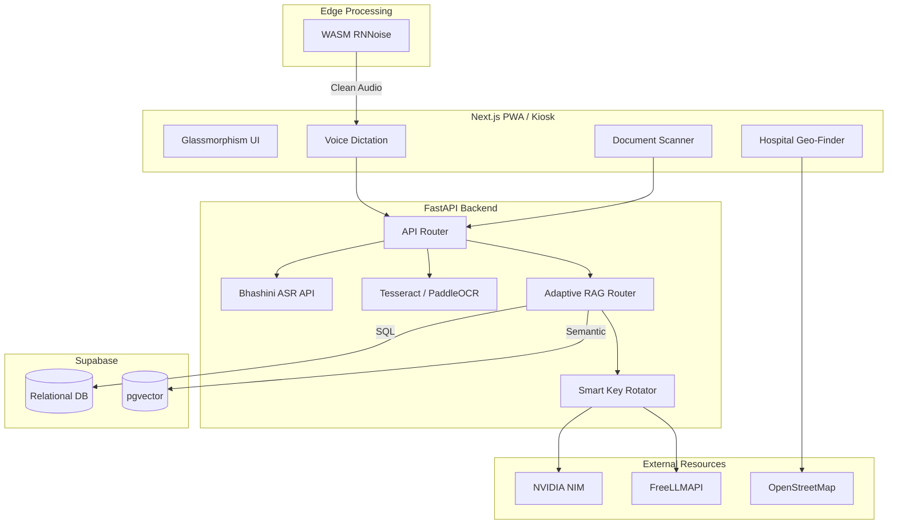
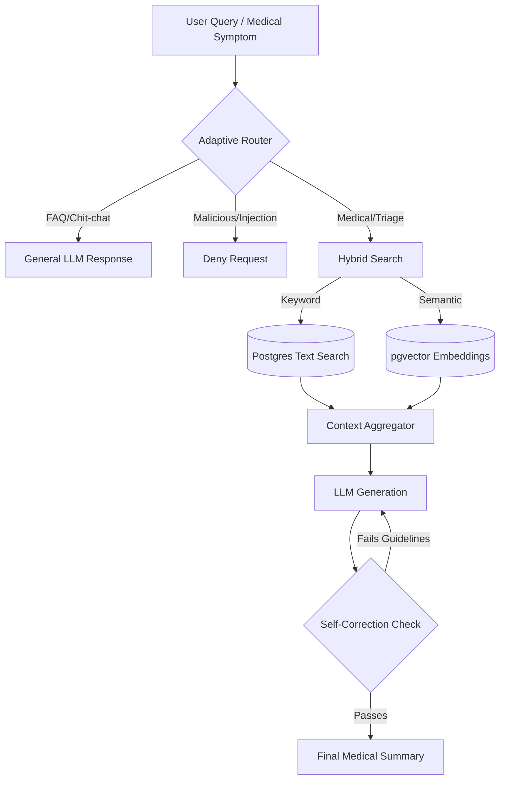
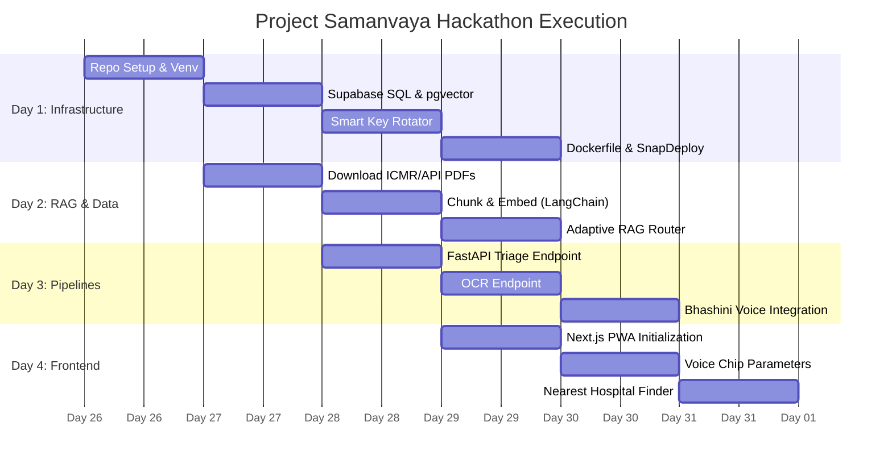

# Project Samanvaya: Comprehensive Analysis & Architecture Strategy

Based on a complete analysis of the SIH 26047 problem statement (Patient Case-Taking Software for Ministry of Ayush), here is a comprehensive breakdown of practical features, technical strategies, and value-adding ideas specifically tailored for the ground realities of Indian public hospitals.

## The Reality of Indian Hospitals (Practical Context)
The core challenge in Indian government hospitals (OPDs) is high patient volume (4,000–10,000/day), minimal doctor consultation time (2-5 minutes), language barriers, and a large proportion of elderly or low-literacy patients. Hardware-heavy solutions (like physical ATM kiosks with IoT sensors) are impractical due to procurement costs, maintenance issues, and the risk of theft/vandalism. 

The most practical approach is a **Hybrid Software System (Progressive Web App - PWA)** running in a locked "kiosk mode" on existing hospital tablets/computers, while also allowing smartphone owners to access it via a QR code/SMS link or from home before visiting.

---

## 1. Technical Strategy & AI Architecture

### A. Eliminating Hospital Noise (The "Noisy Environment" Requirement)
The problem statement explicitly highlights the challenge of "noisy hospital environments". Sending raw, noisy audio to a speech-to-text API will result in garbage text.
**The Solution:**
*   **WebAssembly (Wasm) Edge Noise Suppression:** Implement an open-source, client-side neural network noise suppressor (like **RNNoise** or **DeepFilterNet**) compiled to WebAssembly. 
*   **How it works:** When the patient speaks into the tablet/phone, the browser filters out background fan noise, echoes, and crowd chatter *locally* in real-time, before the audio is even sent to the server. This guarantees a clean voice feed for the ASR engine and saves bandwidth.

### B. The Voice Engine: Why Bhashini is Mandatory
The statement explicitly names **"(Bhashini / AI4Bharat models)"**.
*   **The Decision:** We **must** use the Bhashini API (or self-hosted AI4Bharat IndicWhisper models). 
*   **Why?** Bhashini is the Government of India's official language AI platform (MeitY). Using it aligns perfectly with the "Digital India" and "ABDM" themes of the problem statement. It is specifically trained on rural Indian accents, code-switching (e.g., Hinglish), and 22 regional languages. 

---

## 2. Implementing Government Scheme Integration (The Financial Helper)
Most rural patients are unaware they qualify for schemes like Ayushman Bharat (PM-JAY) or state equivalents like Aarogyasri. Helping them navigate this is a massive "Smart Automation" win.

**How to Implement It Safely & Practically:**
1. **Background Deterministic Rules Engine (No AI Guesswork):**
   * Do not use an LLM for eligibility. Instead, use a hard-coded Python/Node rules engine.
   * *Data points needed:* Age, State of Residence, and Monthly Family Income (or Ration Card type). These are captured during the basic demographic intake or pulled from their ABHA ID.
2. **Instant Matching & Notification:**
   * While the patient is speaking their medical history, the rules engine silently checks the demographic variables against a JSON matrix of active government schemes.
   * If a match is found (e.g., Income < ₹2.5 Lakhs in AP = Aarogyasri eligible), it triggers a UI alert.
3. **Automated Document Checklist Delivery:**
   * Instead of a long application form on the kiosk (which blocks the queue), the system displays: *"You are eligible for free treatment under PM-JAY."*
   * It provides a 1-tap button to send a **PDF Document Checklist** (e.g., "Bring Aadhaar Card + BPL Ration Card to Counter 4") directly to the patient's WhatsApp/SMS.

---

## 3. Practical Core Features (Software-Only & High Impact)

*   **Multimodal Conversational Intake Engine (Voice + Touch):** 
    *   Allows patients to speak in regional languages (Hindi, Telugu, etc.).
    *   Dynamically switches between Allopathic history-taking and Ayurvedic *Dashavidha Pariksha*.
*   **Smart Document Scanner & OCR Pipeline:**
    *   Cleans up messy images of paper prescriptions and extracts structured data.
*   **Offline-First Architecture (Edge Sync):**
    *   Stores data locally (IndexedDB) during internet outages—common in rural CHCs—and syncs automatically when the network returns.
*   **Digital Token & Queue Routing:**
    *   Assigns an intelligent queue token and displays visual directions.

---

## 4. SIH-Specific "Game Changers" (Directly Addressing the Statement)

*   **Pre-Visit Diagnostic Readiness (Baseline Recommender):**
    *   Maps symptoms to standard ICMR/Ayush guidelines to suggest preliminary non-invasive baseline tests (e.g., CBC, Fasting Sugar). 
    *   Clearly labeled as "For Doctor's Verification". Allows doctors to prescribe tests on Day 1, eliminating a wasted second visit.
*   **Dynamic "Ahara-Vihara" (Diet/Lifestyle) Visual Builder:**
    *   Instead of text questions, patients tap a visual "food plate" of common Indian items (rice, spicy curries, sweets) to quickly log their dietary habits, critical for Ayurvedic diagnosis, requiring zero literacy.
*   **OCR-Driven "Abnormal Value" Visual Highlighter:**
    *   When a patient uploads old lab reports, the AI extracts the numerical values, compares them against standard reference ranges, and generates a color-coded table (e.g., Red for high blood sugar) directly on the doctor's screen.
*   **Bilingual Audio-Summary Playback (Consent & Verification Lock):**
    *   Before submission, the app plays a generated audio summary in the patient's language ("You stated you have chest pain..."). The patient taps a green checkmark to confirm. The doctor receives the exact same summary perfectly translated into medical English.
*   **Zero-Click ABHA FHIR Translation:**
    *   The backend automatically formats the extracted JSON (Chief Complaint, HPI, Medications) into the strict **FHIR R4 standard** before pushing it to the Hospital Information System (HIS), making it production-ready for ABDM.

---

## 5. High-Impact Value Additions (Tailored for India)

*   **Smart "Brand-to-Generic" Overdose Guard (Jan Aushadhi Link):**
    *   Maps expensive private brand-name drugs from old OCR'd prescriptions to their generic salts, flagging accidental duplicate dosing, and showing the doctor the subsidized generic alternative available at the government pharmacy.
*   **10-Second Vernacular Audio Consent (DPDP Act 2023 Compliance):**
    *   Legal text is replaced/supplemented with a 10-second audio clip in the local dialect explaining data usage, requiring a simple Yes/No tap. This guarantees true informed consent for low-literacy patients.
*   **Single-Phone Family Multi-Profile Intake:**
    *   Allows a single smartphone user (e.g., head of household) to seamlessly switch between linked family members (under ABHA Family IDs) to generate separate histories and queue tokens without logging out.
*   **Pre-Consultation "Patient Question Prompter":**
    *   Based on the intake, the app generates 2-3 personalized audio prompts for the patient (e.g., "Remember to ask the doctor if you can take this Kadha while fasting") to empower nervous rural patients.
*   **Reverse Doctor Voice Shorthand (Zero-Typing EMR Entry):**
    *   At the end of the 2-minute consult, the doctor taps a mic and speaks medical shorthand (e.g., "Dx: Type 2 DM, Start Metformin 500 BD"). The AI transcribes it directly into the FHIR record, saving 100% of typing time.
*   **Ayurvedic Seasonal Regimen (*Ritucharya*) Auto-Advisory:**
    *   Post-consultation, the app automatically translates the doctor's Ayurvedic lifestyle advice into a personalized seasonal diet chart (based on current Indian weather/monsoon) and sends it via WhatsApp.

---

## 6. Ultra-Complex Tech Stack Selection

Based on the requirement for a robust, scalable, and ₹0-cost initial architecture:

### A. Database, Auth, & Core Backend: **Supabase** (Priority)
**Why Supabase?**
*   **PostgreSQL with pgvector:** Essential for storing any future vector embeddings (e.g., matching symptoms to diagnostic guidelines or Ayurvedic texts).
*   **GoTrue Auth:** Out-of-the-box secure authentication for doctors and administrators.
*   **Edge Functions:** Perfect for handling lightweight webhook events and background syncing.
*   **Real-time Subscriptions:** Crucial for the "Digital Token & Queue Routing" feature (updating the live queue board instantly without continuous polling).
*   *Verdict:* Supabase outperforms Firebase (due to NoSQL query limitations for complex medical data) and Appwrite (less mature vector support) for a relational, AI-heavy healthcare application.

### B. Ultra-Intelligent Brain & AI Model Matrix (Zero-Downtime Router Strategy)
To achieve "ultra-intelligent" conversational capabilities while ensuring 100% uptime and zero cost, we will implement a tiered model router. Every task has a primary state-of-the-art model and a fallback backup.

#### 1. The "Ultra-Intelligent Brain" (Complex Reasoning & FHIR Extraction)
*   **Task:** Understanding messy medical jargon, converting raw speech to strict FHIR JSON, and handling the "Brand-to-Generic" mapping logic.
*   **Primary Engine:** `nvidia/llama-3.1-nemotron-70b-instruct` (via NVIDIA NIM). This is a highly optimized, state-of-the-art model for complex instruction following.
*   **Backup (High Quality):** `google/gemma-2-27b-it` or `mistralai/mixtral-8x22b-instruct-v0.1` (via NVIDIA NIM).

#### 2. Vision & OCR Scanning (Lab Reports & Prescriptions)
*   **Task:** "Reading" uploaded lab reports to extract numerical values and powering the "Abnormal Value Visual Highlighter".
*   **Primary Engine:** `meta/llama-3.2-90b-vision-instruct` (via NVIDIA NIM). This massive multimodal model is exceptionally strong at extracting tables and charts from medical reports.
*   **Backup (NVIDIA Fallback):** `liuhaotian/llava-v1.6-34b` (via NVIDIA NIM).

#### 3. High-Speed Utilities (Patient Prompter & Background Formatting)
*   **Task:** Generating the fast 2-3 personalized audio prompts ("Patient Question Prompter") and formatting scheme checklist PDFs where latency must be <1 second.
*   **Primary Engine:** `meta/llama-3.2-90b-vision-instruct` (via NVIDIA NIM).
*   **Backup:** `nemotron-3.5-lightning-30b-a3b` (via NVIDIA NIM) for ultra-low latency.

#### 4. Speech-to-Text (ASR)
*   **Primary Engine:** **Bhashini API** (AI4Bharat) to handle 22 Indian languages and rural accents (as mandated by SIH).
*   **Pre-Processing:** Local WebAssembly **RNNoise** to filter out hospital background noise before sending audio.
*   **Backup (Fallback ASR):** NVIDIA Riva Translate / Whisper API via NVIDIA NIM if Bhashini is down.

### C. Backend API Layer (Heavy Lifting)
*   **Framework:** **Python (FastAPI)**.
*   **Why:** Python is mandatory for advanced audio processing (RNNoise/WebRTC wrappers), computer vision preprocessing (OpenCV for cleaning images before OCR), and orchestrating the NVIDIA/FreeLLMAPI calls. Supabase Edge Functions (TypeScript) will make REST calls to this FastAPI service for heavy AI tasks.

### D. Frontend Interface (The Kiosk)
*   **Framework:** **Next.js (React)** or **Vite (React)**.
*   **Architecture:** Progressive Web App (PWA) tailored for tablets, with aggressive Service Worker caching and IndexedDB for the "Offline-First" requirement.

---

## 7. Execution Plan of Action (Backend-First Priority)

To ensure the core intelligence works flawlessly before worrying about the UI, we will follow a strict backend-first rollout strategy:

### Phase 1: Infrastructure & Database (Days 1-2)
*   Initialize the **Supabase** project.
*   Design the PostgreSQL schema: `Patients`, `Visits`, `Documents`, `Queue`, and `FHIR_Records`.
*   Set up Row Level Security (RLS) policies to ensure patient data privacy.
*   Deploy the Python FastAPI backend skeleton on a free tier host (e.g., Render/Railway).

### Phase 2: The Core AI Pipelines (Days 3-5)
*   **Audio Pipeline:** Implement the edge noise-cancellation (Wasm) proof-of-concept and connect the cleaned audio stream to the Bhashini API.
*   **OCR Pipeline:** Build the computer vision pre-processor (OpenCV) and integrate the Vision LLM (NVIDIA NIM) to extract lab values.
*   **LLM Router:** Integrate the NVIDIA APIs and FreeLLMAPI router for the "Symptom to FHIR JSON" extraction and the "Brand-to-Generic" mapping.
*   **Rules Engine:** Hardcode the Government Scheme eligibility logic (pure Python logic, no AI required).

### Phase 3: Core API Endpoints & Testing (Days 6-7)
*   Expose FastAPI endpoints for the frontend to consume (e.g., `/api/process-audio`, `/api/upload-lab-report`, `/api/generate-summary`).
*   Test the entire pipeline via Postman/cURL to guarantee the AI generates the correct FHIR JSON and triggers scheme alerts without any frontend dependency.

### Phase 4: Frontend & Kiosk UI (Days 8-10)
*   *Built at the very end.* 
*   Develop the Next.js PWA tailored for 10-inch tablets (locked kiosk mode).
*   Build the interactive "Ahara-Vihara" Visual Food Plate component.
*   Wire up the frontend to the **Supabase Realtime DB** for live queue updates.
*   Connect the UI forms and recording buttons to the FastAPI endpoints to complete the loop.

---

# Project Sambhav: Deep Dive into Chip Parameters, Dynamic Questioning & UI Architecture

Based on a thorough analysis of the codebase, here is a comprehensive breakdown of how the Chip Parameter model, dynamic questioning, and UI components (including glassmorphism) are implemented in Project Sambhav.

## 1. The Chip Parameter Model

The Chip Parameter Model is a flexible, dynamic system for collecting structured input from users. Instead of standard rigid forms, the system uses interactive "chips" (clickable tags) allowing for rapid categorical or numeric selection, with fallbacks for custom inputs.

### Backend Implementation (`api/endpoints/predict.py`)
The backend orchestrates the schema for these parameters.

- **Schema Loading (`/domains`)**: The backend loads domain configurations (e.g., `student`, `health`) from `schemas/domain_registry.yaml`. It parses the `parameters` list.
- **Normalization**: Parameters defined as `type: chips` or `categorical` have their options normalized into a strict `{label, value}` format. If an option is just a string in the YAML, it's converted to `{"label": "...", "value": "..."}`.
- **Data Model**: The schema sent to the frontend includes:
  - `type`: usually `chips`, `categorical`, `numeric`, or `text`.
  - `label` & `description`: For UI presentation.
  - `options`: The normalized list of `{label, value}` pairs.
  - `range`: For numeric inputs (e.g., `[0, 24]`).
  - `weight`: (e.g., `high`, `medium`) to show users which inputs impact the prediction most.
  - `required`: Boolean indicating if the user can skip this step.

### Frontend Implementation (`ChipParameterModal.tsx`)
The `ChipParameterModal` handles the rendering and state of these parameters in a step-by-step wizard.

**Features & Constraints:**
1. **Dynamic Chip Generation**: 
   - For categorical parameters, chips are rendered directly from the `options` array.
   - **Constraint Handling (Numeric)**: If the type is `numeric` and has a `range` (e.g., `[0, 100]`), the modal dynamically generates exactly **5 evenly spaced chip options** (e.g., 0, 25, 50, 75, 100) to allow quick selection without typing.
2. **Dual-Input System**: Every step allows the user to either click a chip OR type a custom value in a free-text/numeric input field below the chips.
3. **State Precedence**: If a user selects a chip, the free-text field clears. If they type in the free-text field, chip selection is cleared. Free-text takes priority on submission.
4. **Data Binding (Bug Fixes)**: The UI binds the visual selection to the `label`, but upon submission (`commitAndAdvance`), it maps it back to the underlying `value` to prevent `[object Object]` submission errors.
5. **Step Navigation & Skipping**: Users can go `Back`, `Next`, or `Skip`. The `Skip` button is disabled if the parameter's `required` flag is `true` and no value is selected.

---

## 2. Dynamic Questioning

Dynamic questioning allows Sambhav to ask the user context-specific questions on the fly, rather than relying on a static, hardcoded list of form fields.

### Discover Params Endpoint (`/predict/discover-params`)
This endpoint is the core of the dynamic parameter generation:
- **LLM Routing**: When a user asks a free-form question (e.g., "Will I pass math if I study 4 hours?"), the backend sends this to a fast LLM (Groq 8B).
- **Prompt Engineering**: The LLM acts as the "Sambhav Dynamic Parameter Generator". It is prompted to generate the 4-6 most relevant parameters needed to predict the outcome of that specific scenario.
- **Strict JSON Output**: The LLM is forced to output a JSON schema matching the Chip Parameter model exactly (including `key`, `label`, `type: "chips"`, `options` array with values, and `weight`).
- **Seamless Integration**: This generated schema is passed directly into the `ChipParameterModal`, creating a highly personalized questionnaire instantly.

### Conversational Mode (`/predict/conversational/*`)
- **`/start` & `/answer`**: These endpoints maintain a `ConversationalSession`. Based on the user's initial question and subsequent answers, the LLM determines the *next best question* to ask, stopping only when the "Reliability Index" reaches a satisfactory threshold to make an accurate prediction.

---

## 3. UI Components & Glassmorphism

Project Sambhav features a premium, dark-themed UI that relies heavily on "Glassmorphism"—a design trend characterized by translucent, frosted-glass-like backgrounds, subtle borders, and vivid floating colors.

### How Glassmorphism is Achieved
Glassmorphism requires three primary CSS components:
1. A semi-transparent background color (usually using `rgba` or Tailwind's opacity modifiers like `bg-white/5`).
2. The `backdrop-filter: blur()` property.
3. A subtle, semi-transparent border to define the edge.

#### Implementation in Streamlit (`streamlit_app/utils/styles.py`)
- **Navigation Bar (`.s-nav`)**:
  ```css
  background: rgba(8,8,10,0.88);
  backdrop-filter: blur(24px); 
  -webkit-backdrop-filter: blur(24px);
  border-bottom: 1px solid var(--border); /* #26242E */
  ```
  This creates a heavily blurred, highly transparent header that allows the background elements to bleed through softly.

#### Implementation in React/Next.js (`ChipParameterModal.tsx`)
- **Modal Overlay (Tailwind)**:
  ```tsx
  className="fixed inset-0 bg-black/60 backdrop-blur-sm z-40"
  ```
  The `backdrop-blur-sm` utility applies a small blur to everything behind the modal, focusing user attention.
- **The GlassCard & Inputs**:
  - Elements use `bg-white/5` (5% opacity white) paired with `border-white/10` (10% opacity white border). 
  - This creates the illusion of a thin sheet of glass sitting on top of the dark background.

### Detailed UI Component Breakdown

1. **Animated Chips (`ChipParameterModal.tsx`)**:
   - Built with `motion.button` (Framer Motion).
   - **Idle State**: `bg-white/5 border-white/10 text-muted-foreground hover:border-white/30`.
   - **Active State**: `bg-primary/20 border-primary text-primary`.
   - **Micro-interactions**: `whileHover={{ scale: 1.04 }}` and `whileTap={{ scale: 0.96 }}` provide tactile feedback.

2. **Buttons (`styles.py`)**:
   - Premium glow effects are achieved using multi-layered box shadows and accent colors (Sakura `#C891AA`, Accent Green `#C2CD93`).
   - `.btn-primary`: Uses a dark background `#130D16` but an outer glow `box-shadow: 0 0 20px rgba(155,90,120,0.2)`. On hover, the glow intensifies to `32px` spread and the button transforms `translateY(-2px)`, making it feel alive and responsive.

3. **Background Atmosphere**:
   - The deep dark theme is enriched by fixed radial gradients in the background that act as "ambient lighting" behind the glass components.
   - `radial-gradient(ellipse 600px 300px at 50% 0%, rgba(155,90,120,0.08) 0%, transparent 70%)` creates a very soft pink glow at the top center of the screen, which becomes visible as you scroll glass panels over it.

4. **Progress Bars**:
   - The modal utilizes a smooth gradient progress bar `bg-gradient-to-r from-primary to-secondary` wrapped in a `motion.div` that animates its width smoothly (`transition={{ duration: 0.4 }}`) as users complete steps.

---

# Applying Sambhav Architecture to Samanvaya

By porting the core engineering of Project Sambhav into Samanvaya, we achieve a highly modern, scalable, and user-friendly system.

## 1. Voice-Enhanced Chip Parameters
We will re-use the exact UI components from Sambhav (GlassCard, animated chips) and the exact premium dark theme color palette (Sakura `#C891AA`, Accent Green `#C2CD93`). 
*   **The Upgrade:** We will add **Voice Dictation** directly into the Chip Parameter Modal. Instead of just clicking a chip or typing in the free-text field, the patient can simply tap a microphone icon. The Bhashini API will transcribe their regional language speech, and the LLM will automatically select the matching chip or fill the input field.

## 2. Medical Dynamic Questioning (Triage)
We will leverage Sambhav's `discover-params` logic to build an **Intelligent Medical Triage System**.
*   **How it Works:** Instead of a massive, intimidating form, the patient gives one initial complaint (e.g., "I have a severe headache"). The LLM dynamically generates 4-5 follow-up chip questions *specifically* relevant to headaches (e.g., "How long has it lasted?", "Any sensitivity to light?", "Rate the pain 1-10").
*   **Why it Matters:** It saves time by only asking required questions, generating a highly accurate FHIR JSON summary for the doctor.

## 3. Nearest Budget-Friendly Hospital Finder (Mobile Exclusive)
Does this feature make sense? **Absolutely.** Indian public hospital OPDs frequently refer patients to external facilities for specialized surgeries or advanced imaging (e.g., MRI) that the local CHC cannot accommodate.
*   **The Feature:** An AI agent on the mobile version that accesses the user's GPS location. 
*   **Functionality:** When a doctor recommends an external test or operation, the agent searches Google Maps (via SerpAPI/Google Places API) for nearby hospitals/clinics, cross-references them with the patient's Ayushman Bharat budget limits, and analyzes Google Reviews to ensure quality.
*   **The Value Proposition:** This directly tackles the anxiety rural patients face when forced to navigate the private healthcare system, ensuring they aren't scammed and find care within their budget.

---

# Part II: Advanced Architecture & Deep Research Integration

Based on the Deep Research results and advanced architectural requirements, here is the finalized, ultra-comprehensive technical spec for Project Samanvaya.

## 1. Finalized Tech Stack & Cardless Infrastructure

| Component | Selected Technology | Specific Version/Requirement | Purpose & Justification |
| :--- | :--- | :--- | :--- |
| **Backend Framework** | FastAPI (Python) | `fastapi==0.110.0`, `uvicorn==0.27.1` | High-performance async API for audio processing and RAG. |
| **Container Hosting** | SnapDeploy / Render | Docker container | 100% free, cardless deployment for the FastAPI backend. |
| **Database & Auth** | Supabase (PostgreSQL) | `supabase==2.4.5` | Stores relational patient data (ABHA), queue system, and auth. |
| **Vector Database (VDB)** | pgvector (via Supabase) | Built-in Supabase extension | Cardless VDB for storing medical embeddings. Keeps relational and vector data in one place. |
| **Noise Cancellation** | RNNoise (WebAssembly) | `rnnoise-wasm` | Edge-based (browser) background noise suppression for OPDs. |
| **OCR Scanner** | Tesseract / PaddleOCR | `pytesseract==0.3.10` / `paddleocr==2.7.3` | Free extraction of lab reports and prescriptions. |
| **Geo-Location** | OpenStreetMap (Nominatim) | API (No installation) | Cardless hospital finder (avoids Google Maps API fees). |
| **Frontend UI** | Next.js / React (PWA) | `next==14.2.0`, `tailwindcss==3.4.1` | Kiosk-mode web app with Glassmorphism UI. |

## 2. LLM Selection & Smart Key Rotator

The research concluded that while free endpoints exist, specialized medical models are rare. Therefore, we rely on high-reasoning general models heavily grounded by our RAG.

**Models to Generate Keys For (All via NVIDIA NIM):**
*   *Ultra-Intelligent Brain (Primary Triage):* `nvidia/llama-3.1-nemotron-70b-instruct`
*   *Fast Triage (Secondary):* `meta/llama-3.2-11b-vision-instruct`
*   *OCR / Vision Model:* `meta/llama-3.2-90b-vision-instruct`
*   *Medical RAG Embedding:* `snowflake/arctic-embed-l`
*   *RAG Reranking:* `nvidia/llama-nemotron-rerank-vl-1b-v2`

### The Dynamic Fail-Safe Key Rotator Pattern
To prevent rate-limit crashes during the hackathon, we will implement a dynamic `Smart Key Rotator`:
*   Instead of comma-separated strings, the `.env` file uses specific line-by-line numbered slots for each model (e.g., `NVIDIA_LLAMA_3_3_70B_KEY_1`, `NVIDIA_LLAMA_3_3_70B_KEY_2`).
*   The system allows the user to dynamically add as many keys as they want simply by adding a new line with the next number.
*   A Python utility scans the environment for these prefixes, aggregates them into a list, and uses `random.choice(keys_array)` to randomly select a key for *every single API request*.

### Exact Environment Configuration (`.env`)
The entire backend relies on these exact environment variables. Note that keys are provided *without* double quotes.
```env
# Database configuration
SUPABASE_URL=https://rdnjnycxooxuolntrpny.supabase.co
SUPABASE_KEY=your_supabase_anon_key

# NVIDIA Llama 3.3 70B Keys (Primary Triage)
NVIDIA_LLAMA_3_3_70B_KEY_1=key_1
NVIDIA_LLAMA_3_3_70B_KEY_2=key_2

# NVIDIA Llama 3.2 90B Vision Keys (Secondary Triage / Multimodal)
NVIDIA_LLAMA_3_2_90B_KEY_1=key_1

# NVIDIA Phi-4 Multimodal Keys (OCR)
NVIDIA_PHI_4_KEY_1=key_1

# Bhashini API Key (Voice)
BHASHINI_API_KEY=your_bhashini_key
```
## 3. Multi-Architectured RAG Module (The Medical Brain)

We are implementing an **Adaptive, Self-Corrective Agentic RAG** system to ensure 0% hallucination on medical data and extreme resilience against prompt injection.

### A. Data Sources
*   **ICMR Standard Treatment Workflows (STWs)**
*   **Ayurvedic Pharmacopoeia of India (API)**
*   **WHO Interagency Integrated Triage Tool (IITT)**

### B. The Multi-Architecture Pipeline
1. **Query Routing (Adaptive RAG):** When a query comes in, a lightweight LLM router determines if it's a medical triage question, a general FAQ, or a malicious prompt injection. It routes to the appropriate sub-system.
2. **Hybrid Retrieval:** For medical queries, we query the Supabase `pgvector` store using **Hybrid Search**:
    *   *Keyword Search (BM25):* Ensures we hit the exact drug name or terminology.
    *   *Semantic Search (Vector):* Captures the context and symptoms.
3. **GraphRAG Concepts:** We will structure our chunks with metadata (e.g., `{disease: "Hypertension", type: "Ayurvedic_Remedy"}`) to ensure the LLM receives logically grouped facts, acting like a knowledge graph.
4. **Self-Corrective Generation (Self-RAG):** The LLM generates a response and cites its sources. An internal validation prompt then checks: *"Does this response perfectly align with the retrieved ICMR guidelines? Is it safe?"* If no, it regenerates. If yes, it passes to the doctor.

## 4. Ultra-Comprehensive Execution Workflow

We will build the modules in a strict sequence, prioritizing the most complex backend AI infrastructure first.

### Day 1: Core Infrastructure & Fail-Safes
*   **Step 1:** Initialize GitHub Repo and Python Virtual Environment (`pip install fastapi uvicorn supabase langchain-community sentence-transformers`).
*   **Step 2:** Provision Supabase. Enable `pgvector`. Run SQL migrations for `patients`, `visits`, and `medical_embeddings` tables.
*   **Step 3:** Implement the `Smart Key Rotator` for NVIDIA NIM / FreeLLMAPI.
*   **Step 4:** Write the `Dockerfile` and deploy the skeleton to SnapDeploy/Render.

### Day 2: Data Ingestion & Multi-Architecture RAG
*   **Step 1:** Download ICMR and Ayurvedic PDFs.
*   **Step 2:** Write an ingestion script using LangChain to chunk the PDFs, generate embeddings via a free Cohere/sentence-transformers model, and push to Supabase `pgvector`.
*   **Step 3:** Implement the Adaptive RAG router, Hybrid Search logic, and Self-Corrective validation loops.

### Day 4: AI Pipelines (Voice, OCR, Triage)
*   **Step 1:** Expose FastAPI endpoint for Medical Triage (Dynamic Questioning via LLM).
*   **Step 2:** Expose endpoint for OCR processing (PaddleOCR/Tesseract).
*   **Step 3:** Integrate the Bhashini API wrapper for speech-to-text.

### Day 5: Frontend UI (Kiosk & Mobile)
*   **Step 1:** Initialize Next.js PWA. Implement Glassmorphism styling and dark theme (`#C891AA`, `#C2CD93`).
*   **Step 2:** Build the `Voice-Enhanced Chip Parameter Modal`.
*   **Step 3:** Build the mobile-exclusive `Nearest Budget Hospital Finder` calling the OpenStreetMap API.
*   **Step 4:** Wire all frontend components to the FastAPI backend.

---

## 5. Architectural & Execution Block Diagrams

### A. Core System Workflow Architecture


### B. Adaptive Multi-Architecture RAG Pipeline


### C. Execution Plan Workflow


---

## 6. "Gemini Live-Style" Bidirectional Conversational Loop
To achieve a highly fluid, intelligent interaction exactly like Gemini Live, we are implementing a continuous voice loop.
*   **Yes, Bhashini provides Voice Output (TTS):** Bhashini supports high-quality Text-To-Speech (TTS) in multiple Indian languages.
*   **The Loop:** 
    1. **Listen:** Patient speaks (RNNoise cleans the audio -> Bhashini ASR converts to text).
    2. **Think:** Our Adaptive RAG LLM processes the text and decides what question to ask next.
    3. **Speak:** The LLM's text output is sent to Bhashini TTS, which speaks the question out loud to the patient in their native tongue.
*   This creates a 100% hands-free, interactive interview that feels just like talking to a real, empathetic human triage nurse.

## 7. Safety, Privacy, and Fail-Safe Architecture
Project Samanvaya will handle sensitive Protected Health Information (PHI). We are implementing military-grade privacy checks to ensure ABDM (Ayushman Bharat Digital Mission) compliance:

### A. Fail-Safe Operations
*   **Database Transaction Rollbacks:** Every database write (e.g., saving a patient visit) in FastAPI will be wrapped in SQL transaction blocks. If the server crashes mid-write, the entire transaction rolls back cleanly so no corrupted partial records exist.
*   **Key Rotator Logging:** If an API key hits a rate limit, the Smart Key Rotator logs the failure, immediately switches to a backup key, and retries the request invisibly to the user.

### B. Privacy & Security (ABDM Compliance)
*   **Supabase RLS (Row Level Security):** We will enable strict RLS policies. A patient scanning their QR code can *only* read their own `user_id` rows. A hospital terminal can only read patients checked into that specific hospital.
*   **PII Stripping Before LLM Processing:** Before we send patient symptoms to external LLMs (NVIDIA NIM/FreeLLMAPI), a lightweight Python regex function will strip any names, phone numbers, or Aadhaar numbers. The LLMs will only see the medical symptoms (e.g., "Patient has a headache"), ensuring no private data leaks to third-party AI providers.
*   **Audit Logging:** Every single action (patient intake, doctor prescription, scheme check) is written to a tamper-proof `audit_logs` table in Supabase.