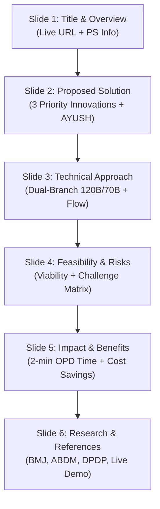
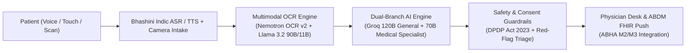
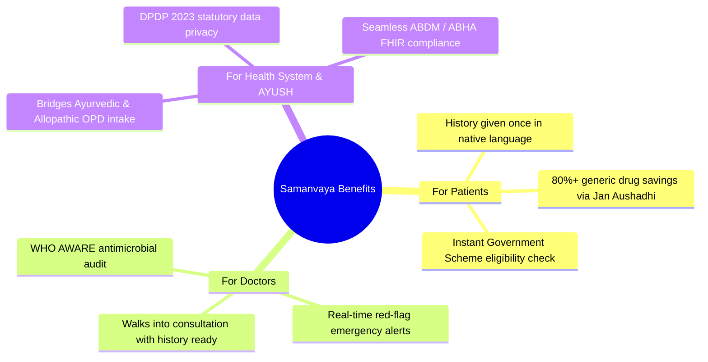

# SIH 2026 Presentation Blueprint & Shortlisting Strategy
## Project Samanvaya — Team Panchajanyam
**Problem Statement ID:** SIH26047  
**Problem Statement Title:** Patient Case-Taking Software  
**Ministry / Nodal Agency:** All India Institute of Ayurveda (AIIA), Ministry of Ayush  
**Theme:** MedTech / BioTech / HealthTech  
**Category:** Software  
**Live Prototype URL:** [https://project-samanvaya.vercel.app](https://project-samanvaya.vercel.app)

---

> [!IMPORTANT]
> **SIH Shortlisting Rule #1:** In Smart India Hackathon, initial evaluation is **100% based on the PPT (uploaded as PDF)**. Evaluators review thousands of entries in minutes. 
> To guarantee shortlisting:
> 1. **Keep strictly to 6 slides** (including Title slide).
> 2. **No dense text paragraphs** — use bullet points, bold key metrics, tables, and visual architecture blocks.
> 3. **Highlight your LIVE WORKING PROTOTYPE** prominently on Slide 1 & Slide 3.
> 4. **Highlight key innovations in requested priority order** (Government Scheme Engine, Floating AI Assistant, PM Jan Aushadhi Engine, AYUSH + Allopathy Dual Intake, Multimodal Doctor Handwriting OCR).

---

## Slide-by-Slide Content & Layout Guide

---

### SLIDE 1: Title Page

**Header Banner:** SMART INDIA HACKATHON 2026  
**Project Title:** **PROJECT SAMANVAYA**  
*Tagline:* **Capture. Connect. Cure.** — *An AI Clinical History-Taking & Document Intake Platform for India's AYUSH and Allopathic OPDs.*  
**Live Prototype:** `https://project-samanvaya.vercel.app`

| Field | Details |
| :--- | :--- |
| **Problem Statement ID** | **SIH26047** |
| **Problem Statement Title** | **Patient Case-Taking Software** |
| **Nodal Ministry / Organization** | **All India Institute of Ayurveda (AIIA), Ministry of Ayush** |
| **Theme** | **MedTech / BioTech / HealthTech** |
| **PS Category** | **Software** |
| **Team ID** | **[Your Registered Team ID]** |
| **Team Name** | **Team Panchajanyam** |

> [!NOTE]
> **Key Visual Accent for Slide 1:** Add 3 small badge pills at the bottom:  
> `[✔ Live Working Prototype]` `[✔ AYUSH Dashavidha Pariksha]` `[✔ ABDM / ABHA Compliant]`

---

### SLIDE 2: Proposed Solution (Restructured for SIH26047 & Bhashini AI Suite)

**Headline:** **Unified Vernacular Patient Intake, Multimodal Document AI & Ayush-Allopathy Clinical Scribe**

#### **Core Summary Box (Main Subtitle):**
> *"An ABDM-compliant clinical history platform that leverages Bhashini's full Indic AI suite and a dual-branch LLM architecture (120B/70B) to capture vernacular history, digitize handwritten prescriptions, evaluate government health schemes, and generate physician-verified EHR case sheets in under 20 seconds."*

---

#### **LEFT COLUMN: CORE SIH26047 MODULES (WHAT IS BUILT)**

1. 🎙️ **Multimodal Voice + Touch Intake (Bhashini AI Suite)**
   * **Text:** Powered by Bhashini's **ASR, TTS, NMT, ALD (Audio Language Detection), VAD (Voice Activity Detection)** and **Denoiser** for noisy OPD waiting rooms. Features adaptive SOCRATES questioning in 22 Indic languages + **AIIA Dashavidha & Trividha Pariksha** for Ayush OPDs.

2. 👁️ **Medical Document Intelligence (Module B)**
   * **Text:** 4-tier OCR cascade (OCR.Space Engine 3 + Nemotron OCR v2 + Llama 3.2 Vision + Groq 120B) for handwritten doctor slips, lab reports & discharge notes; auto-dates into chronological timelines & highlights abnormal lab values.

3. 📋 **Structured Case Summary & Physician Desk (Module C)**
   * **Text:** Synthesizes patient inputs into a standard EHR draft (*Chief Complaint → HPI → History → ROS → Vitals*) for 1-click doctor verification; features **bilingual patient-audio confirmation**.

4. 🔒 **DPDP Act Vault & ABDM FHIR Push (Module D)**
   * **Text:** Statutory DPDP Act 2023 consent modal with audio explanation; session-purged secure processing; direct **ABHA ID linkage & FHIR R4 JSON push** into hospital HIS.

---

#### **RIGHT COLUMN: GAME-CHANGING INNOVATIONS (WHERE SAMANVAYA GOES FURTHER)**

1. 🥇 **Govt Scheme Evaluation Engine** *(Priority #1 Innovation)*
   * **Text:** Real-time auto-eligibility evaluation for **PM-JAY (Ayushman Bharat)**, **AB-PMJAY Senior Citizen (70+)**, **Tele-MANAS**, and State Health Schemes directly from intake diagnosis and demographics.

2. 🥈 **Floating Multilingual AI Health Coach** *(Priority #2 Innovation)*
   * **Text:** Interactive vernacular voice/chat assistant providing post-consultation prescription explanation, dosage guidance, and lifestyle advice in native dialects.

3. 🥉 **PM Jan Aushadhi Generic Savings Engine** *(Priority #3 Innovation)*
   * **Text:** Matches brand-name drugs to generic PMBJP equivalents with **80%+ direct out-of-pocket cost savings** & pinpoints nearest Kendras via live GPS.

4. 🛡️ **WHO AWARE Stewardship & Dual-Branch AI Core** *(Priority #4 Innovation)*
   * **Text:** Dual-branch 120B + 70B consensus model grounded in ICMR treatment guidelines; audits prescribed antibiotics against **WHO Access, Watch, Reserve (AWARE)** tiers to combat AMR.

---

### SLIDE 3: Technical Approach (Architecture & Data Flow)

**Headline:** **Dual-Branch Clinical Reasoning Engine, Multimodal OCR & ABDM FHIR Pipeline**

#### Technical Stack & Modular Architecture
* **Frontend UI:** Responsive Next.js 16 (Turbopack) PWA with glassmorphic UI, high-contrast accessibility, and touch-optimized kiosk design.
* **Voice & Vernacular AI:** **Bhashini API** + Sarvam Voice AI for Indic speech recognition (ASR) and text-to-speech (TTS) across 22 Indian languages.
* **Multimodal OCR & Vision:** Multi-tier cascade (OCR.Space Engine 3 + NVIDIA Nemotron OCR v2 + Llama 3.2 90B/11B Vision) for reading handwritten doctor slips.
* **Dual-Branch Clinical Reasoning Core:**
  * *Branch A (General Reasoning):* Groq **openai/gpt-oss-120b** (120 Billion parameters) for colloquial symptom parsing and vernacular translation.
  * *Branch B (Medical Specialist):* NVIDIA **meta/llama-3.3-70b-instruct** grounded in ICMR treatment guidelines & WHO AWARE standards.
* **Data Privacy & ABDM Integration:** **DPDP Act 2023-compliant** digital consent vault; encrypted session purging; direct ABDM M2/M3 FHIR JSON push.

---

### SLIDE 4: Feasibility and Viability

**Headline:** **Zero-Hardware OPD Footprint, Offline Resilience & Risk Mitigation**

#### 1. Technical Feasibility
* **Zero Hardware Overhead:** Runs on low-cost Android tablets or desktop web browsers already available in government CHCs, PHCs, and hospital waiting rooms.
* **Standards-Compliant:** Plugs directly into existing ABDM infrastructure via standard FHIR R4 JSON schemas and ABHA identifiers.

#### 2. Economic & Operational Viability
* **Software-As-A-Service (SaaS) Scalability:** Deployed centrally per OPD desk rather than per-patient hardware, minimizing capital expenditure.
* **Direct Patient Value:** PM Jan Aushadhi generic mapping delivers **80%+ direct out-of-pocket savings** for vulnerable patients.
* **Doctor-In-The-Loop:** The platform generates a *draft* case sheet — the doctor retains 100% clinical authority to edit, accept, or reject in seconds.

#### 3. Potential Challenges & Risk Mitigation Matrix

| Challenge / Risk | Severity | Mitigation Strategy in Samanvaya |
| :--- | :--- | :--- |
| **Low Digital Literacy / Elderly Patients** | High | Audio-guided voice intake via Bhashini; zero-text icon touch targets; assistant kiosk mode. |
| **Unreliable Hospital Internet Connectivity** | Medium | Offline-first Progressive Web App (PWA) caching; local browser storage during intake. |
| **Handwritten Prescription OCR Ambiguity** | Medium | Pharmacological regex safety net + dual-branch LLM cross-verification + doctor 1-click edit. |
| **Data Privacy & Patient Consent** | High | DPDP Act 2023 explicit audio/touch consent modal; raw document scans purged post-extraction. |

---

### SLIDE 5: Impact and Benefits

**Headline:** **Reclaiming OPD Time, Digitizing ABDM First Mile & Protecting Patients**

#### 1. Quantitative Impact Metrics
* ⏱️ **Reclaims 70%+ Consultation Time:** Reduces history-taking time from **3 minutes to under 20 seconds**, allowing doctors to focus on physical examination and patient interaction.
* 💰 **80%+ Reduction in Drug Costs:** Instant Jan Aushadhi generic mapping cuts out-of-pocket prescription expenses significantly.
* 🛡️ **100% ABDM First-Mile Digitization:** Turns unstructured paper visits into structured digital health records (EHR/EMR) linked to ABHA.

#### 2. Multi-Stakeholder Benefits

---

### SLIDE 6: Research, Standards & References

**Headline:** **Grounded in Peer-Reviewed Research & National Digital Health Infrastructure**

#### 1. Peer-Reviewed Clinical Research
1. **BMJ Open (2017):** Irving G, et al. *"International variations in primary care physician consultation time: a systematic review of 67 countries."* (Documenting India's 2-minute OPD crisis).
2. **WHO Antimicrobial Stewardship (AWARE Classification):** Access, Watch, Reserve framework for rational antibiotic prescribing.

#### 2. Government Standards & Platforms Built On
* **Ayushman Bharat Digital Mission (ABDM):** ABHA identity, Health Information Exchange (HIE-CM), and FHIR R4 clinical data specifications.
* **Bhashini (National Language Translation Mission):** Government Indic language ASR/TTS models across 22 official Indian languages.
* **Digital Personal Data Protection (DPDP) Act, 2023:** Statutory framework for digital consent and data minimization.
* **ICMR Standard Treatment Workflows (STW):** Clinical guidelines backing the Medical Specialist Reasoning Branch.
* **Pradhan Mantri Bhartiya Janaushadhi Pariyanjana (PMBJP):** Generic medicine master database and live GPS Kendra locator.
* **Tele-MANAS & PM-JAY:** National mental health helpline and Ayushman Bharat health insurance scheme guidelines.

#### 3. Live Demonstration & Repository
* 🌐 **Live Web Application:** [https://project-samanvaya.vercel.app](https://project-samanvaya.vercel.app)
* 📹 **Interactive Demo Routes:** `/his/doctor`, `/his/ocr`, `/his/schemes`, `/patient`

---

## 🎯 Summary Checklist for Shortlisting Success

- [x] **Strict 6-Slide Limit** (Complies with SIH 2026 Template)
- [x] **PDF Output** (Export `.pptx` to `.pdf` before uploading on portal)
- [x] **Includes Live Prototype URL** (`https://project-samanvaya.vercel.app`)
- [x] **Features Priority Innovations** (Govt Schemes, Floating AI Assistant, Jan Aushadhi, AYUSH Dashavidha Pariksha)
- [x] **Visual Layout** (Tables, Flowcharts, Mindmaps, Bullet Points — Zero Wall of Text)
